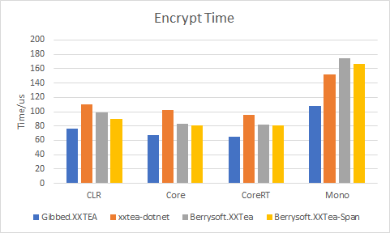
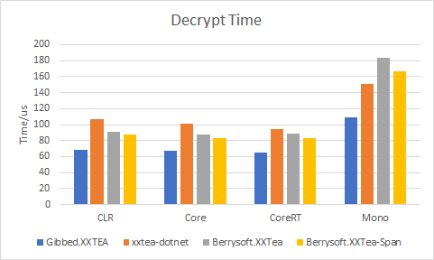
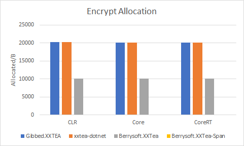
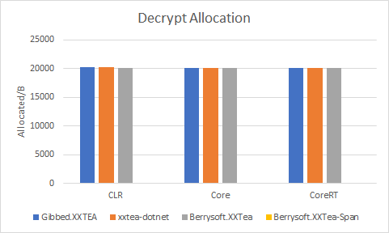

# Berrysoft.XXTea
A .NET implementation of [TEA](https://en.wikipedia.org/wiki/Tiny_Encryption_Algorithm), [XTEA](https://en.wikipedia.org/wiki/XTEA) and [XXTEA](https://en.wikipedia.org/wiki/XXTEA) algorithm.

[](https://strawberry-vs.visualstudio.com/Berrysoft.XXTea/_build?definitionId=8)


## Usage
``` csharp
var cryptor = new XXTeaCryptor("SuperStrongKey");
var encryptedData = cryptor.EncryptString("Hello world!"); // Encrypt
var decryptedData = cryptor.DecryptString(encryptedData); // Decrypt
```

## Benchmark
The other two XXTEA implementation:
* [Gibbed.XXTEA](https://github.com/gibbed/Gibbed.XXTEA)
* [xxtea-dotnet](https://github.com/xxtea/xxtea-dotnet)

```
BenchmarkDotNet=v0.11.5, OS=Windows 10.0.18995
Intel Core i5-7200U CPU 2.50GHz (Kaby Lake), 1 CPU, 4 logical and 2 physical cores
.NET Core SDK=3.0.100
  [Host] : .NET Core 3.0.0 (CoreCLR 4.700.19.46205, CoreFX 4.700.19.46214), 64bit RyuJIT
  Clr    : .NET Framework 4.7.2 (CLR 4.0.30319.42000), 64bit RyuJIT-v4.8.3921.0
  Core   : .NET Core 3.0.0 (CoreCLR 4.700.19.46205, CoreFX 4.700.19.46214), 64bit RyuJIT
  CoreRT : .NET CoreRT 1.0.28208.02 @BuiltBy: dlab14-DDVSOWINAGE101 @Branch: master @Commit: 9a09d481951a9bcf7b5a736e2de43a788c758904, 64bit AOT
  Mono   : Mono 6.4.0 (Visual Studio), 64bit
```

## Speed
|||
|:-:|:-:|
|Encrypt Time|Decrypt Time|
Berrysoft.XXTea is slightly slower than Gibbed.XXTEA, mostly because of virtual function calls.

## Allocation
|||
|:-:|:-:|
|Encrypt Allocation|Decrypt Allocation|

Berrysoft.XXTea uses less allocation, and even no allocation with data in Span.
